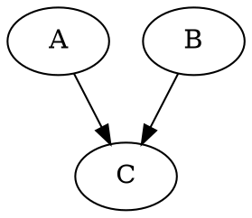
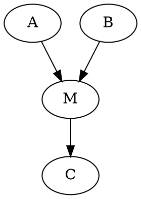

# Causality - excercise sheet 1, Karol Kuczmarz, Jakub Kuciński
<!-- $\newcommand{\ind}{\perp\!\!\!\!\perp}$ -->
## Task 1
### a:
| A | B | C | P(A,B,C) |
|:----:|:----:|:----:|:----:|
| 0 | 0 | 0 | 0 |
| 0 | 0 | 1 | 1/4 |
| 0 | 1 | 0 | 1/4 |
| 0 | 1 | 1 | 0 |
| 1 | 0 | 0 | 1/4 |
| 1 | 0 | 1 | 0 |
| 1 | 1 | 0 | 0 |
| 1 | 1 | 1 | 1/4 |

| A | C | P(A,C) |
|:----:|:----:|:----:|
| 0 | 0 | 1/4 |
| 0 | 1 | 1/4 |
| 1 | 0 | 1/4 |
| 1 | 1 | 1/4 |

| A | B | P(A,B) | P(A,B\|C=0) | P(A,B\|C=1) |
|:----:|:----:|:----:|:----:|:----:|
| 0 | 0 | 1/4 | 0 | 1/2 |
| 0 | 1 | 1/4 | 1/2 | 0 |
| 1 | 0 | 1/4 | 1/2 | 0 |
| 1 | 1 | 1/4 | 0 | 1/2 |

### b:
- $(A \perp\!\!\!\!\perp  B)_P$
Holds, as A and B are two independently tossed coins so they are independent. Of course the equality $\forall_{a,b \in \{0,1\}} P(A = a, B = b) = P(A = a) P(B = b)$ holds as it is equivalent to $\frac{1}{4} = \frac{1}{2} \cdot \frac{1}{2}$ in all cases.
- $(A \perp\!\!\!\!\perp C)_P$
Holds. Similarly to the case above.
- $(A \perp\!\!\!\!\perp B | C)_P$
Does not hold. Counterexample:
$P(A=0|C=0) \cdot P(B=0|C=0) = \frac{1}{2} \cdot \frac{1}{2} = \frac{1}{4} \neq 0 = P(A,B|C=0)$

### c:

### d:
- $(A \perp\!\!\!\!\perp B)_G$
D-separated because there is a colider $A\rightarrow C \leftarrow B$ and $C \notin Z$
- $(A \perp\!\!\!\!\perp C)_G$
Not d-separated because $Z$ is empty and there is no colider on the path $A \rightarrow C$
- $(A \perp\!\!\!\!\perp B | C)_G$
Not d-separated because there is a colider $A\rightarrow C \leftarrow B$, but $C \in Z$

### e:
The opposite implication:
$$
(X \perp\!\!\!\!\perp Y|Z)_P \Rightarrow (X \perp\!\!\!\!\perp Y|Z)_G
$$
does not hold. Counterexample from this exercise:
$(A \perp\!\!\!\!\perp C)_P$ holds, but $(A \perp\!\!\!\!\perp C)_G$ does not hold.

## Task 2

$X = \{A, \, B \}$ and $Y = \{G, \, H \}$

### a: find all $Z$ that $(X \perp\!\!\!\!\perp Y\, | \, Z)_G$

Let's look at node $F$. Node $F$ has to be in every d-separator becasue it is the only node that can d-separate $B$ and $H$ on path $B - F - H$.

With analogous argument we show that $Z$ must include $C$ or $E$ because of the path $A - C - E - H$.

1. Let's assume that $C \in Z$. Then $D$ must also be in $Z$ for the path $A - C - D - G$ to be blocked. We conclude that sets $\{C,\,D,\,F \}$ and $\{C,\,D,\,F, \, E \}$ are d-separators.
2. Let's assume that $E$ is in $Z$. Then every path from $A$ or $B$ to $H$ is blocked. $C$ is a collider outside of $Z$ but it has a descendant in $Z$ so we cannot make use of it. That's why $D$ must be in $Z$ and set $\{F,\,E,\,D \}$ is a d-separator.

To sum up, these sets are d-separators of $A$ and $B$:
$$
\{F,\, C,\, D \},\, \{F,\, E,\, D \} \text{ and } \{ F, \, C,\, D, \, E \}
$$

### b:

Counterexample (for the second part of the problem, it is more precise than the first part)

$X = \{A,\, C\}$
$Y=\{B\}$
If $Z = \emptyset$, then $C$ and $B$ aren't d-separated, because on path connecting them there is no collider and $Z$ is empty.
If $Z = \{ M \}$, then $A$ and $B$ aren't d-connected because $M$ is in $Z$ and there is no $i 
\rightarrow j \rightarrow k$ and no $i \leftarrow j \rightarrow k$ pattern on the path.

### c: all minimal d-separators

Based on thinking described in **a** the minimal d-separators of $X$ and $Y$ are sets
$$
\{F,\, C,\, D \} \text{ and } \{ F, \, D, \, E \}
$$

## Task 3

### 1. $P(L=l^1 | S=s^0)$

$$
\displaystyle P(L=l^1 | S=s^0) = \frac{P(L=l^1, S=s^0)}{P(S=s^0)} =\\= \frac{1}{P(S=s^0)} \sum_{d, i, g} P(d)P(i)P(g|i,d)P(s^0|i)P(l^1|g)
$$

$$
P(S=s^0) = \sum_{i}P(i)P(S=s^0|i) = 0.7\cdot 0.95 + 0.3 \cdot 0.2 = 0.725
$$

$$
P(L=l^1, S=s^0) = \sum_{d, i, g} P(d)P(i)P(g|i,d)P(s^0|i)P(l^1|g)
=\\= \sum_{d} P(d) \sum_{i} P(i) P(s^0|i) \sum_{g} P(g|i,d) P(l^1|g)
=\\= 0.6 \cdot (0.7 \cdot 0.95 \cdot (0.3 \cdot 0.9 + 0.4 \cdot 0.6 + 0.3 \cdot 0.01) 
+\\+ 0.3 \cdot 0.2 \cdot (0.9 \cdot 0.9 + 0.08 \cdot 0.6 + 0.02 \cdot 0.01)) 
+\\+ 0.4 \cdot (0.7 \cdot 0.95 \cdot (0.05 \cdot 0.9 + 0.25 \cdot 0.6 + 0.7 \cdot 0.01)
+\\+ 0.3 \cdot 0.2 \cdot (0.5 \cdot 0.9 + 0.3 \cdot 0.6 + 0.2 \cdot 0.01)) 
=\\= 0.6 \cdot (0.7 \cdot 0.95 \cdot 0.513 + 0.3 \cdot 0.2 \cdot 0.8582)
+\\+ 0.4 \cdot (0.7 \cdot 0.95 \cdot 0.202 + 0.3 \cdot 0.2 \cdot 0.632)
=\\= 0.6 \cdot 0.392636 + 0.4 \cdot 0.17225 = 0.3044816
$$ 

$$
\displaystyle P(L=l^1 | S=s^0) = \frac{P(L=l^1, S=s^0)}{P(S=s^0)} = \frac{0.3044816}{0.725} = 0.41997462
$$

### 2. $P(L=l^1 | S=s^1)$
This can be calculated in the same way as the previous example.

$$
\displaystyle P(L=l^1 | S=s^1) = \frac{P(L=l^1, S=s^1)}{P(S=s^1)} =\\= \frac{1}{P(S=s^1)} \sum_{d, i, g} P(d)P(i)P(g|i,d)P(s^1|i)P(l^1|g)
$$

$$
P(S=s^1) = \sum_{i}P(i)P(S=s^1|i) = 0.275
$$

$$
P(L=l^1, S=s^1) = \sum_{d, i, g} P(d)P(i)P(g|i,d)P(s^1|i)P(l^1|g)
=\\= \sum_{d} P(d) \sum_{i} P(i) P(s^1|i) \sum_{g} P(g|i,d) P(l^1|g) = 0.19785
$$

$$
\displaystyle P(L=l^1 | S=s^1) = \frac{P(L=l^1, S=s^1)}{P(S=s^1)} = \frac{0.19785}{0.275} = 0.71945
$$

### 3. $P(L=l^1 | \textrm{do}(S=s^0))$

$$
\displaystyle P(L=l^1 | \textrm{do}(S=s^0)) = P(L=l^1) = \\= 
\sum_{d,i,g} P(l^1 | g) P(g|d,i) P(i)P(d) = \\ = \sum_dP(d) \sum_iP(i)\sum_gP(l^1|g)P(g|d,i) = 0.502336
$$

### 4. $P(L=l^1 | \textrm{do}(S=s^1))$

The same as **3.**

### 5. $P(L=l^1 | D=d^0)$

$$
P(L=l^1 | D=d^0) =\frac{1}{P(d^0 )} \sum_gP(g)P(l^1,d^0|g) = \\ \text{G d-separates L and D} \\= \frac{1}{P(d^0)}\sum_gP(g)P(l^1|g)P(d^0|g) = \\ \text{Bayes' theorem} \\ =\frac{1}{P(d^0)}\sum_gP(g)P(l^1|g) \frac{P(g|d^0) P(d^0)}{P(g)} = \\ = \sum_gP(l^1|g)P(g|d^0) = \sum_{g,i}P(l^1|g)P(g|d^0,i)P(i) = 0.61656
$$

### 6. $P(L=l^1 | D=d^1)$

$$
P(L=l^1 | D=d^1) =\frac{1}{P(d^1 )} \sum_gP(g)P(l^1,d^1|g) = \\ \text{G d-separates L and D} \\= \frac{1}{P(d^1)}\sum_gP(g)P(l^1|g)P(d^1|g) = \\ \text{Bayes' theorem} \\ =\frac{1}{P(d^1)}\sum_gP(g)P(l^1|g) \frac{P(g|d^1) P(d^1)}{P(g)} = \\ = \sum_gP(l^1|g)P(g|d^1) = \sum_{g,i}P(l^1|g)P(g|d^1,i)P(i) = 0.331
$$

### 7. $P(L=l^1 | \textrm{do}(D=d^0))$
$$
P(L=l^1 | \textrm{do}(D=d^0)) = \sum_{g,i} P(l^1 | g) \cdot  P(g | \textrm{do}(D=d^0), i) \cdot P(i) = 0.61656
$$

### 8. $P(L=l^1 | \textrm{do}(D=d^1))$
$$
P(L=l^1 | \textrm{do}(D=d^1)) = \sum_{g,i} P(l^1 | g) \cdot  P(g | \textrm{do}(D=d^1), i) \cdot P(i) = 0.331
$$

### Findings

Observing low SAT score gives us lower probability of getting a strong letter than we get when we observe high SAT score. Changing to intervention changes the probability, however there is no difference whether we set the SAT score to low or high as it doesn't influence the strength of recommendation letter (it is not a predecessor of letter).

In the examples with difficulty we can see, that there is no difference whether we observe or intervene on difficulty, only the value of difficulty matter. The difference is that in the examples with SAT score, SAT score is dependent on intelligence which is the grandparent of recommendation letter. Difficulty is not dependent on any variable. That's why we don't see any difference in observing/intervening on it.
